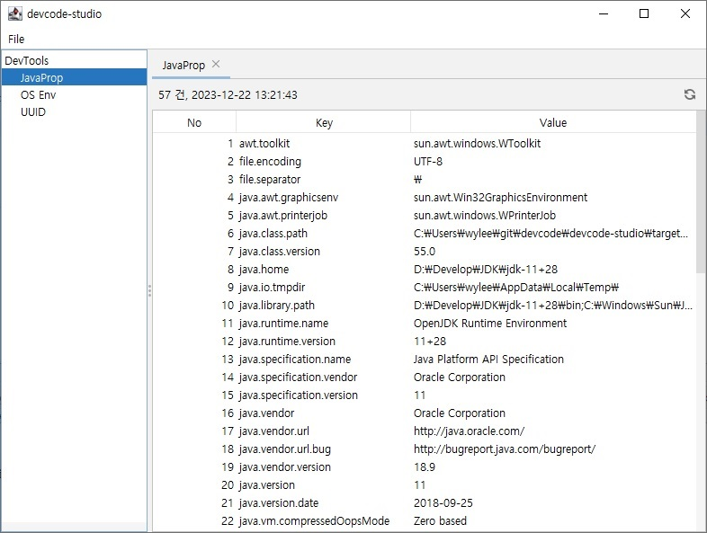
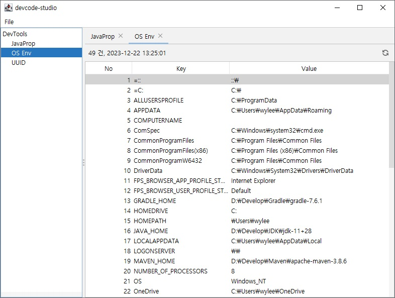
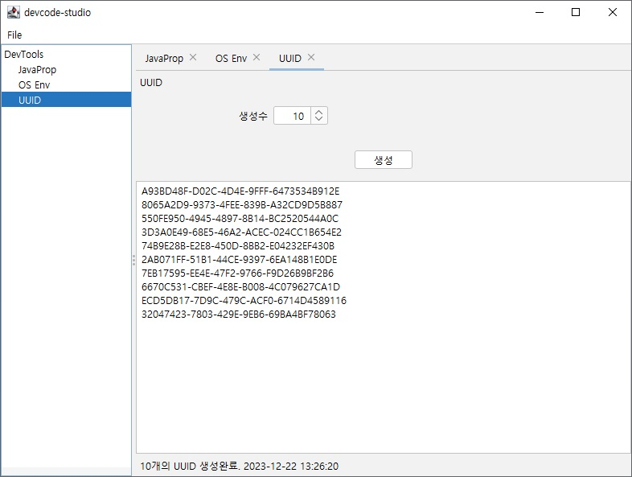

## devcode-studio
개발을 도와주는 Java Swing 기반의 UI 프로그램


### 기능들
1. Java Proerties 내용을 조회하는 기능
2. System.getEnv 내용을 조회하는 기능
3. UUID 값을 생성하는 기능


### 개발환경
* JDK 11
* Maven 3.8


### 빌드 및 실행
```shell
git clone https://github.com/wyleedp/devcode.git
cd devcode\devcode-studio
mvnw clean package
java -jar target\devcode-studio.jar
```


### 예제
Java Proerties



OS Environment



UUID 생성

